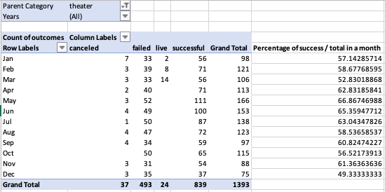
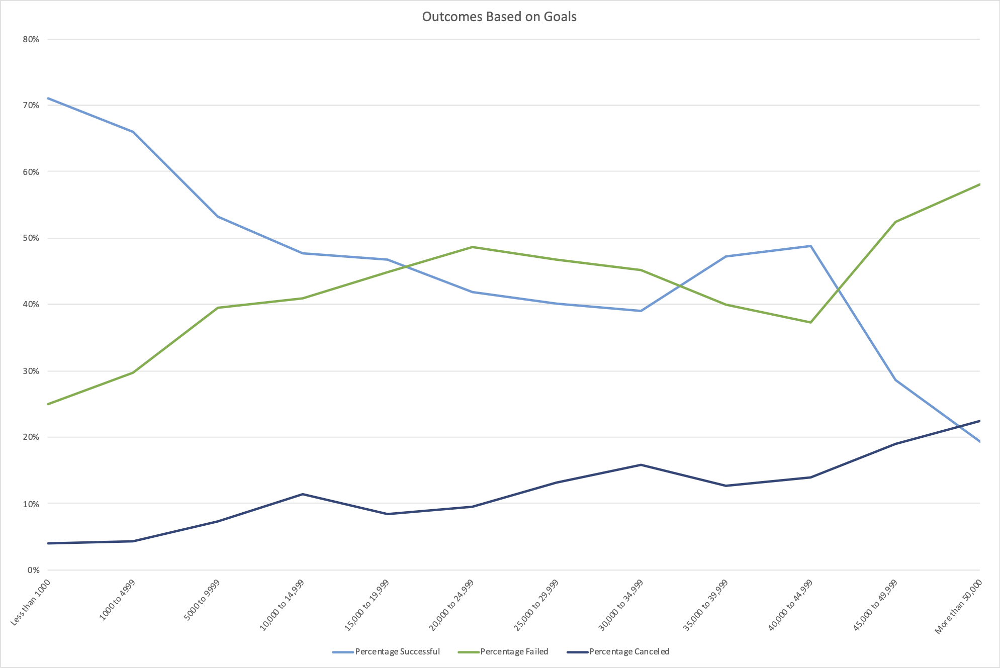

# Kickstarting with Excel

## Background
The initial purpose of our analysis is to help up & coming playwright, Louise in her crowdfunding campaign, for her play Fever.
Her budget is a little over $10,000 (which includes sets, costumes, rehearsal space, actors, etc ) and this will be her first fundraising campaign. She wants to know if her campaign will be successful.
Due to our initial analysis, Louise’s play Fever came close to its fundraising goal in a short amount of time.

## Overview of Project
From our previous partnership, she now wants to know how different campaigns fared in relation to their launch dates and their funding goals.
The same dataset from her first analysis which is the dataset from 2009 to 2017, will be used for this second analysis.

### Purpose
Louise will like to know how different campaigns fared in relation to their launch dates and their funding goals.

## Analysis and Challenges

### Methodology: Analytics Paradigm

#### 1. Decomposing the Ask
What are the different campaigns from Louise's point of view?
The different campaigns can be seen from 2 perspectives, either from the Main / Parent Category and the Sub-Category.
Louise did not specify which country she will be producing the play in. In the first analysis, she has asked for both data from USA and Great Britain so going by this assumption, we will assume she might be interested in the analysis for both countries.

#### 2. Identify the Datasource
As Louise was only fundraising from Kickstarter, our dataset which is directly culled from Kickstarter is a good dataset. However, a considerable time has elapsed since her first request for analysis which has given her a high success rate.
We do not have the data between 2018 to 2021. Especially with the current climate of Covid-19 global pandemic, where social events with big crowds are not permitted, our second analysis using the older dataset will not give Louise an accurate analysis for her to take further actions with Kickstarter today. What we presented below must be considered as informational pre-pandemic snapshot of Kickstarter analysis.

#### 3. Define Strategy & Metrics
1. Campaign
    1. Main / Parent Category
    1. Sub-Category

1. Countries
    1. USA
    1. Great Britain

#### 4. Data Retrieval Plan:
* Use Kickstarter dataset in Excel

#### 5. Assemble & Clean the Data:
* Excel formatting & formulas

#### 6. Analyse for Trends:
1. Category & Sub-Category
1. Goals
1. Launch Dates

#### 7. Acknowledging Limitations:
1. Dataset is not up-to-date. We do not have data from 2019 to 2021. These are also the years when Covid-19 happened.
1. Other marketing elements in a campaign:
  * Is this what the target market really wants?
  * Quality of marketing copy writing & campaign video
  * Quality of backers incentive rewards and the different tiers
  * How is the campaign promoted outside of Kickstarter, e.g. social media
  * Consistent campaign updates, e.g. "25% funded" that will give backers confidence
  * Transparency of updates even after hitting goals, e.g. Updates on any change of plan or any potential delays in production

#### 8. Making the Call:
The "Proper" Conclusion is indicated below on [Results](#results)

## Analysis

### Analysis of Outcomes Based on Launch Date

The above shows that _**theatre campaign**_ that launches in May, June and July  between the years 2009 to 2017 have the highest rate of successfully achieving their fundraising goals.
The month of May has the highest successful campaigns at 111 success out of a total of 166.
While the months of June has 100 successful campaigns out of a total of 153 and July has 87 successful campaigns out of a total of 138.

The month of December has the lowest successful campaigns with only 37 out of a total of 75.

If we look at the trend lines for both successful & failed campaigns, we can see that that the trends lines are quite similar with the exception of June and December.  

While the chart above may show that launches in May, June and July have the highest number of successful campaigns, the data may be skewed as these months also have the highest number of launches and therefore by sheer volume it only makes sense that these months will have high successful campaigns. Therefore in addition to this chart, we will like to include another table for consideration, please see [Analysis of Percentage Outcomes Based on Launch Date](#analysis-of-percentage-outcomes-based-on-launch-date)

### Analysis of Outcomes Based on Goals

The above shows that _**play campaigns**_ (a sub category of Theatre) with the most likely change of reaching their goals are campaigns below $1000; with 84%% campaigns reaching their funding goals.

Second highest campaigns to reach their goals are campaigns between _**$1000 to $4999**_; with _**76% campaigns reaching their funding goals**_.

Third highest campaigns to reach their goals are campaigns between _**$35,000 to $39,999**_ and campaigns between _**$40,000 to $44,999**_; with both having _**67% campaigns reaching their funding goals**_.

Funding goals between *$45,000 to $49,999 has the highest failed* rate at *0% campaigns reaching their funding goals*; followed by goals *above $50,000* at *13% campaigns reaching their funding goals*. The third funding goals most likely to fail is goals between *$25,000 to $29,999* at *20% campaigns reaching their funding goals*.

While the chart above may show that campaigns with funding goals below $5000 have the highest percentage of being successfully funded, campaigns goals between $35,000 to $44,999 only have a total of 9 campaigns with 6 successful thus giving it a success rate of 67%. This dataset is too small to ensure that Louise's campaign will also have 67% chance of reaching her funding goal if she was to launch a similar play campaign with funding goals between $35,000 to $44,999.

## Challenges

### Challenges and Difficulties Encountered

For [Analysis of Outcomes Based on Launch Date](#analysis-of-outcomes-based-on-launch-date), initially it seems like Louise only has the 3 months ( **May**, **June**, **July**) out of a year to be able to have a better chance at a successful Kickstarter campaign. However, when we look deeper at the dataset, we will see that while the numbers of successful campaigns are launched during those months, those are also the months with the highest campaign launches. Therefore we need to take into consideration the *percentage of successful campaigns vs the total number of campaigns launched* in the same month. For this data, please see [Analysis of Percentage Outcomes Based on Launch Date](#analysis-of-percentage-outcomes-based-on-launch-date).

## Results

- What are two conclusions you can draw about the Outcomes based on Launch Date?
Based on [Analysis of Outcomes Based on Launch Date](#analysis-of-outcomes-based-on-launch-date), we can conclude that the best month for Louise to launch her Kickstarter campaign is in the month of May. If she misses the May launch date, she can also consider launching for the month of June or July.
December is the worst month to launch a campaign and should be avoided.

- What can you conclude about the Outcomes based on Goals?
Based on [Analysis of Outcomes Based on Goals](#analysis-of-outcomes-based-on-goals),we can see that funding goals of _**$5000 and below**_ have a better chance of achieving their target at _**66%**_ and more.
However, very large funding goals between _**$40,000 to $44,999**_ is 4th in the chart with a success rate of **49%** after funding goals between _**$5000 to $9999**_ which has the success rate of _**53%**_.

If Louise has funding goals above $50,000; it is better if she breaks them down into a few smaller funding goals of _**$5000, $10,000, $15,000**_ and _**$45,000**_.

- What are some limitations of this dataset?
The dataset only shows the outcomes of all campaigns without taking into consideration the _**quality of the campaigns**_ as listed in [Analysis & Challenges -> Acknowledging Limitations](#7-acknowledging-limitations).

- What are some other possible tables and/or graphs that we could create?

#### Analysis of Percentage Outcomes Based on Launch Date

With this table, we can see that even though _**May**_ is still the best month to launch a campaign at _**66.86%**_ success rate, the other months have campaign success rates between 49% to 63%.
When we include this into our consideration, it goes to show that Theatre campaigns launches for the months of:
_**April, May, June, July, September**_ and _**November**_ have _**60%**_ & above success rates.

Therefore _**April, September**_ and _**November**_ can be taken into consideration as secondary launch months if Louise had missed the window between May to July.

#### Analysis of All Category Outcomes Based on Goals

We want to examine the pledger's behaviour in Kickstarter funding for all categories. The chart above shows all categories outcome based on goals.

With this chart, we can see that campaigns with the most likely change of reaching their goals are campaigns below $1000; with 76% campaigns reaching their funding goals.
Second highest campaigns to reach their goals are campaigns between $1000 to $4999; with 66% campaigns reaching their funding goals.
Third highest campaigns to reach their goals are campaigns between $5000 to $9999; with 53% campaigns reaching their funding goals.
Fourth highest campaigns to reach their goals are campaigns between $10,000 to $14999 and between $40,000 to $44999; with 48% campaigns reaching their funding goals and 49% campaigns reaching their funding goals, respectively.

Funding goals above $50,000 has the highest failed rate at 58% and canceled rate at 23%; followed by goals between $45,000 to $49,999 at 52%. The third funding goals most likely to fail is goals between $20,000 to $24,999 at 49%.
