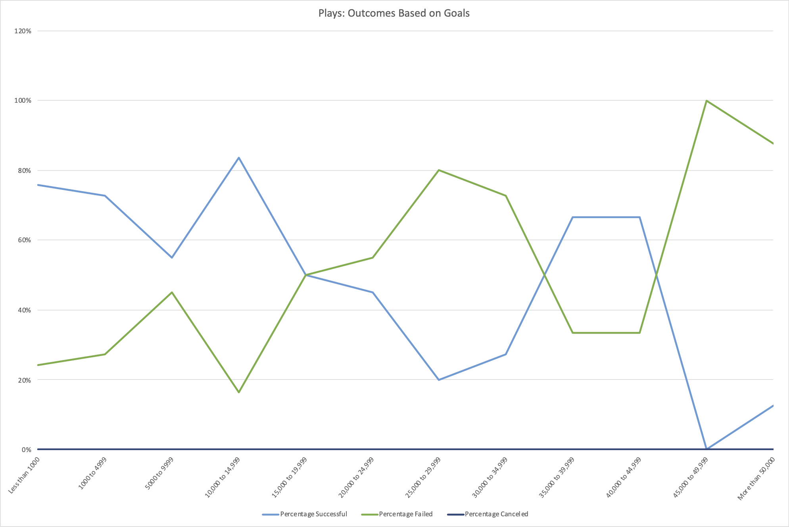

# Kickstarting with Excel

## Background
The initial purpose of our analysis is to help up & coming playwright, Louise in her crowdfunding campaign, for her play Fever.
Her budget is a little over $10,000 (which includes sets, costumes, rehearsal space, actors, etc ) and this will be her first fundraising campaign. She wants to know if her campaign will be successful.
Due to our initial analysis, Louise’s play Fever came close to its fundraising goal in a short amount of time.

## Overview of Project
From our previous partnership, she now wants to know how different campaigns fared in relation to their launch dates and their funding goals.
The same dataset from her first analysis which is the dataset from 2009 to 2017, will be used for this second analysis.

### Purpose
Louise will like to know how to different campaigns fared in relation to their launch dates and their funding goals.

## Analysis and Challenges
Decomposing the Ask:
What are the different campaigns from Louise's point of view?
The different campaigns can be seen from 2 perspectives, either from the Main / Parent Category and the Sub-Category.
Louise did not specify which country she will be producing the play in. In the first analysis, she has asked for both data from USA and Great Britain so going by this assumption, I will assume she is interested in the analysis for both countries.

Identify the Datasource:
As Louise was only fundraising from Kickstarter, our dataset which is directly culled from Kickstarter is a good dataset. However, a considerable time has elapsed between her first request for analysis which has given her a high success rate and present.
We do not have the data between 2018 to 2021. Especially with the current climate of Covid-19 global pandemic, where social events with big crowds are not permitted, our second analysis using the older dataset will not give Louise an accurate analysis for her to take further actions with Kickstarter today. What we presented below must be considered as informational pre-pandemic snapshot of Kickstarter analysis.

Define Strategy & Metrics:
Campaigns: Main / Parent Category & Sub-Category
Countries: USA, Great Britain

Data Retrieval Plan:
Use Kickstarter dataset in Excel.

Assemble & Clean the Data:
Excel formatting & formulas.

Analyse for Trends:
Category & Sub-Category
Goals
Launch Dates

Acknowledging Limitations:
* 1. Dataset is not up-to-date.

* 2. Other marketing elements in a campaign:
  * 2.1 Is this what the target market really wants?
  Quality of marketing copy writing & campaign video
  Quality of backers incentive rewards and the different tiers
  How is the campaign promoted outside of Kickstarter, e.g. social media
  Consistent campaign updates, e.g. "25% funded" that will give backers confidence
  Transparency of updates even after hitting goals, e.g. Updates on any change of plan or any potential delays in production

Making the Call:
The "Proper" Conclusion is indicated below on [Results](#results)

### Analysis of Outcomes Based on Launch Date

From the above chart, we can see that for theatres campaigns

### Analysis of Outcomes Based on Goals

### Challenges and Difficulties Encountered

## Results

- What are two conclusions you can draw about the Outcomes based on Launch Date?

- What can you conclude about the Outcomes based on Goals?

- What are some limitations of this dataset?

- What are some other possible tables and/or graphs that we could create?
